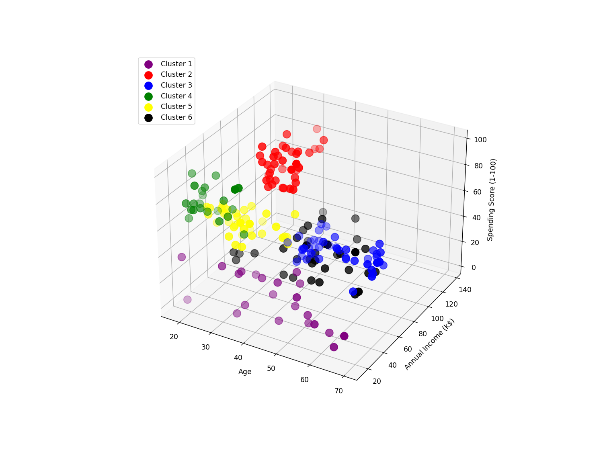

# Customer-Segmentation-Using-K-Means
This is an implementation of Unsupervised Learning. Here I have used K-Means Clustering to make clusters which gives an statistical idea of given data.  
Given data has 200 Hypothetical data points of a mall in total.  
Mall_Customers.csv file containes the data set and Figure.png is the image of 6 clusters plotted on 3d graph, clusters are formed by Segmenting Age, Annual Income and Spending Scores of Customers.  
  
Image of Clusters  
  
Here I have used elkon algorithm in K-Means.  
To understand the data better I have plotted various graphs and used 2-Dimensional K-Means Clustering between Age & Spending Score and Annual Income & Spending Score, This helps us to better understand, not only the data but also the K-Means Clustering Technique.  
#
In this to plot 3d graph and to make it interactive I have used ``` %matplotlib widget ```
which uses ipympl in backend ,that is easily installable by using ``` pip install ipympl ```.
